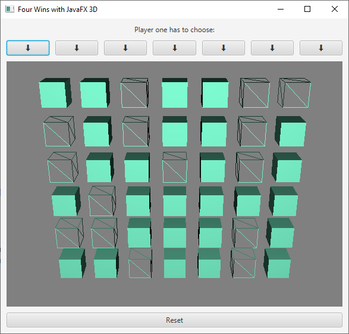

# Four Wins with JavaFX 3D

This repository provides an implementation of the game "four wins" with JavaFX 3D. We use this project to teach Java programming at [University of Applied Sciences Upper Austria, Campus Wels](https://www.fh-ooe.at/en/wels-campus/).

